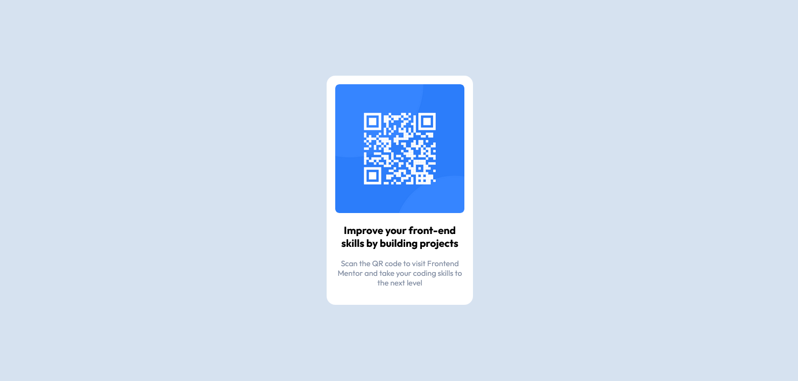

# Frontend Mentor - QR code component solution

This is a solution to the [QR code component challenge on Frontend Mentor](https://www.frontendmentor.io/challenges/qr-code-component-iux_sIO_H). Frontend Mentor challenges help you improve your coding skills by building realistic projects. 

## Table of contents

- [Overview](#overview)
  - [Screenshot](#screenshot)
  - [Links](#links)
- [My process](#my-process)
  - [Built with](#built-with)
  - [What I learned](#what-i-learned)
  - [Continued development](#continued-development)
  - [Useful resources](#useful-resources)
- [Author](#author)
- [Acknowledgments](#acknowledgments)


## Overview

### Screenshot



### Links

- Solution URL: [https://www.frontendmentor.io/solutions/qr-code-component-using-htmlcss-rkjTJGmVc](https://www.frontendmentor.io/solutions/qr-code-component-using-htmlcss-rkjTJGmVc)

## My process

- First, I analyzed the design and looked at what assets had been provided.

- I then created a gitHub local repository and imported all the files into it. Published the repo.

- Opened up VSCODE and created the HTML file. Created the basic structure of elements. Ready for CSS.

- At this point I was confused whether the background was an overlay or the body of the page itself. Decided it would be easier to center the main component with an overlay.

- I was using nested flexbox/grid technique and I was struggling to match the borders of the image with the borders of the flexbox/grid borders and to get the image to scale according to the size of the main-container. I think it was probably because of the text elements underneath, which were causing issues with alignment.

- Ultimately, i fixed the issue by resizing the image and text very small at first, and then creating a grid of 1 column to wrap both of the elements. Then i set both elements width to 100%, so that they scaled to fit the grid.

### Built with

- HTML5 markup
- CSS
- Flexbox
- CSS Grid
- Position: absolute;

### What I learned

Use this section to recap over some of your major learnings while working through this project. Writing these out and providing code samples of areas you want to highlight is a great way to reinforce your own knowledge.

To see how you can add code snippets, see below:

This project definitely helped my design skills. I enjoyed breaking down the project into individual elements before i started coding anything. It helped me get a clear picture of some of the CSS required which made those parts really straightforward later on. For example, things like font-weight, padding, colors were very simple.

One part I really struggled with was using a combination of Flexbox and CSS Grid to create the main design. (Container - Image - Text)
The image, and text were'nt filling up their respective flexboxes correctly and borders were not lining up. I was having problems in sizing everything to make it look like the reference design.

I fixed this by making all the elements really small, then creating a CSS Grid of 1 Column to wrap them.
Then i set the width of the elements to 100%, which fixed the issue and they filled their containers perfectly.
Now,
When i resized the main container with the grid, everything inside resized accordingly and when i resized the elements, nothing overflowed and the main container expanded to fit everything nicely.

I definitely need to practice more CSS Grid and Flexbox.

``` 
.popup {
    background-color: hsl(0, 0%, 100%);
    z-index: 200;
    position: absolute;
    display: grid; 
    grid-template-columns: 300px;
    row-gap: 20px;
    justify-content: center;
    padding: 20px;
    border-radius: 20px;
}
.qr-code-image {
    width: 100%;
    border-radius: 10px;
}
.popup-text-container {
    display: flex;
    flex-direction: column;
    row-gap: 20px;
    margin-bottom: 20px;
}
```

I'm also kind of proud of my HTML structure, it is pretty neat. Although, i am not sure if i was correct in using an overlay.
```
        <div class="overlay">
            <div class="popup">
                <div class="popup-image-container">
                    
                </div>
                <div class="popup-text-container">
                    <p class="main-text">
                        Improve your front-end skills by building projects
                    </p>
                    <p class="sub-text">
                        Scan the QR code to visit Frontend Mentor
                        and take your coding skills to the next level
                    </p>
                </div>
            </div>
        </div>
```

### Continued development

I want to learn and focus more on CSS Grid and Flexbox, Nested Layouts Technique. I also want to learn more Semantic HTML to make my code more accessible.

## Author

- Discord - SharksDontBark#3123
- Frontend Mentor - [@riverCodes](https://www.frontendmentor.io/profile/riverCodes)

## Acknowledgments

I'd like to thank FrontEndMentor for this project and the ones I'll be doing in the future. I was a little bit overwhelmed at first with everything, but once I actually took in everything step by step and started to code, it was really fun. There were a few hickups but when i did finish it was the best feeling ever. I hope I can continue to develop and get really good at this stuff.

**Note: Delete this note and edit this section's content as necessary. If you completed this challenge by yourself, feel free to delete this section entirely.**
